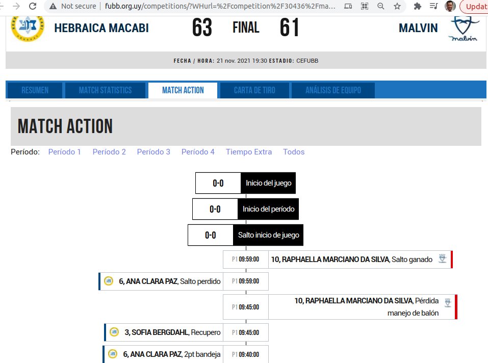

# Extrae las valores de los Match 

Desde la pagina [http://www.fubb.org.uy/competitions/?WHurl=%2Fcompetition%2F30436%2Fmatch%2F2009972%2Fplaybyplay%3F](http://www.fubb.org.uy/competitions/?WHurl=%2Fcompetition%2F30436%2Fmatch%2F2009972%2Fplaybyplay%3F) 
extraemos la información de los Juegos.
 Hidrometeorológicas. 

Gráficamente:



Tutorial en Youtube:
[](https://www.youtube.com/watch?v=xxx)


## Instalación de dependencias
Instalamos las librerias dependientes desde requirements.txt

```bash
pip3 install -r requirements.txt
```

## Ejecutar
Al ejecutar el comando 

```bash
python run.py
```
Se procederá a:
 - crear la estructura de directorios
 - descargar el archivo fuente en la carpeta tmp/download
 - exportar la información de los juevos que se encuentran en el archivo a csv, el mismo se guardara en la carpeta data/


